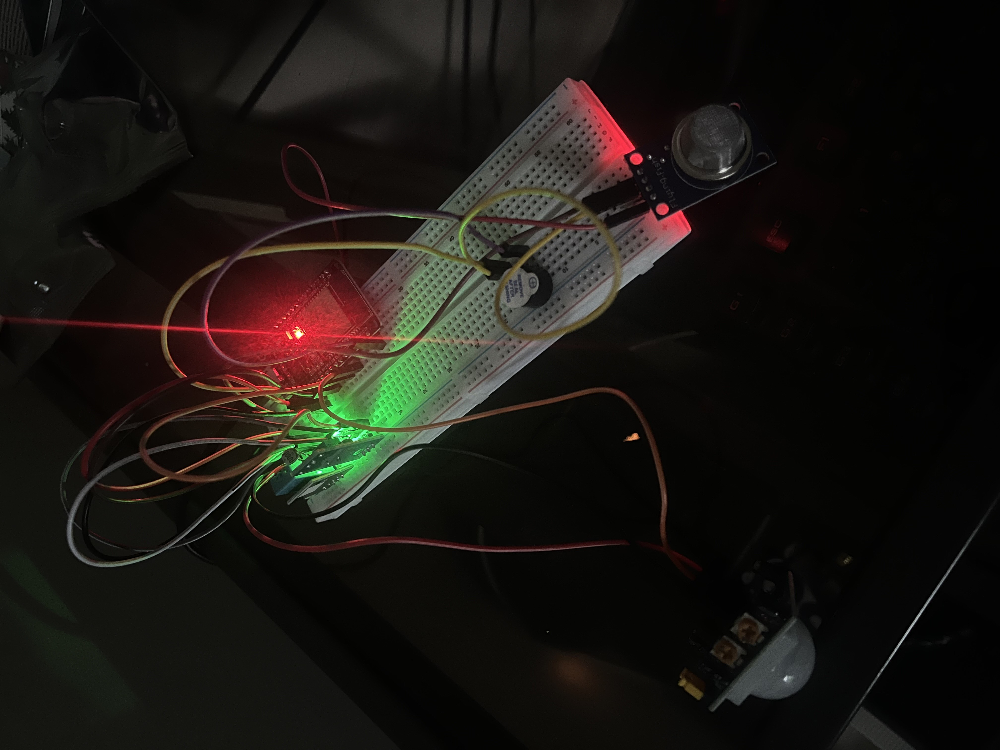

# Smart Home Sensor System

This is a full-stack Internet of Things (IoT) project that collects, stores, and visualizes real-time sensor data from an ESP32 device. 

## Features
- Real-time sensor data: Temperature, humidity, air quality, movement, and light
- Backend server built to handle, store, and send data
- Interactive app displaying live and historical data
- Easy data visualization using data smoothing and downsampling
- Modular architecture designed to easily handle new sensors

## Media
<table align="center" style="width: 100%; table-layout: fixed;">
  <tr>
    <td align="center" style="width: 50%;">
      <br>
        <em>Breadboard with sensors and ESP32 module</em>
    </td>
    <td align="center" style="width: 50%;">
      <br>
        <em>React Native app showing live sensor data</em>
    </td>
  </tr>
</table>


##  Tech Stack
- Hardware:
    - ESP32 device
    - Breadboard with temperature, humidity, air quality, motion, and light sensors
- Low-Level Firmware:
    - C++ programming using Ardunio IDE
    - JSON serialization for transmission of sensor data
- Backend:
    - Node.JS and Express.JS server for data transmission
    - SQLite database for data storage
- Frontend:
    - React Native mobile app
    - react-native-chart-kit for data visualization

- Other Tools:
    - Arduino IDE, VSCode, Git, Expo Go

## About / Usage
This was my first project with hardware and an IoT focus. I found working with hardware very interesting — wiring the breadboard and sensors was intimidating but rewarding. It was also my first time using JSON data for sensor communication and my second time building an app using React Native, which made this project unique.

**NOTE:** This repository is a technical demonstration and portfolio project as opposed to a proper IoT program that can be easily replicated yourself. The ESP32 device must be connected on your local network to send sensor data to the server, and the app must be connected on that same network in order to receive the data. This means this project will not work on your device. If you're curious to try it yourself, here are the build instructions.

### Getting Started
1. Install any dependencies and start the Node.js server:
     ```bash
    npm install
    node server.js
    ```
2. Launch expo to begin the app
     - Download Expo Go from your app store
    ```bash
    npx expo start
    ```
    - Scan the QR code to view the app

## Author
**Pearce Packman** - [Website](https://pearcepackman.com/) | [LinkedIn](https://www.linkedin.com/in/pearce-packman/)

## License
This project is licensed under the MIT License
